<p align="center">
  
</p>

<h2 align="center">📡 Truyền Thông Không Dây — Bài tập Nhóm + Đồ án Cuối Kỳ 📡</h2>

<p align="center">
  
  
  
  
  
</p>

<p align="center">
  
  
  
  
</p>

<p align="center">
  <a href="https://github.com/lhlizdabezt/TruyenThongKhongDay">
    
  </a>
</p>

---

## 👥 Tác giả / Authors — Nhóm 1

> ⚠️ **Đây là sản phẩm nhóm 2 người.** Cả 2 thành viên đều đóng góp và đồng chịu trách nhiệm về nội dung. Repository này được publish với sự đồng thuận của cả nhóm.

| Vai trò              | Họ tên               | MSSV         | Email                              |
| -------------------- | -------------------- | ------------ | ---------------------------------- |
| 👨‍💻 Thành viên 1     | **Lương Hải Long**  | `22207056`   | 22207056@student.hcmus.edu.vn      |
| 👨‍💻 Thành viên 2     | **Lý Phi Hùng**     | `22207112`   | 22207112@student.hcmus.edu.vn      |

**Giảng viên hướng dẫn:**
- 🎓 **TS. Đặng Lê Khoa** — Khoa Điện tử Viễn thông, HCMUS
- 🎓 **CN. Nguyễn Dũng** — Khoa Điện tử Viễn thông, HCMUS

---

## 🎯 Tổng quan

Repository gồm **2 sản phẩm chính** của môn **Truyền thông Không dây (TTKD)** học kỳ I/2025–2026, lớp `22DTV_CLC1`:

1. 📕 **Bài tập nhóm** ([`BaiTap/`](BaiTap/)) — bài làm 5 chương trọng tâm: kênh suy hao diện rộng, diện hẹp, bộ cân bằng, OFDM, MIMO.
2. 🛰️ **Đồ án cuối kỳ** ([`DoAn/`](DoAn/)) — **"Mô phỏng kênh suy hao diện rộng và hẹp"** với MATLAB: free-space path loss + shadowing + Rayleigh multipath + BER Monte Carlo, tổng 36 trang gồm cơ sở lý thuyết, phương pháp mô phỏng, kết quả & phân tích, mã nguồn MATLAB phụ lục.

> 🧠 **Triết lý báo cáo:** đi từ **công thức Friis** ($P_r = P_t G_t G_r (\lambda/4\pi d)^2$) → **mô hình empirical** (log-normal shadowing) → **multipath Rayleigh** → **kết hợp 2 mức** → mô phỏng MATLAB → đối chiếu với phân tích Monte Carlo.

---

## 📕 Bài tập nhóm — `BaiTap/BaiTapTTKD_Nhom1_22DTV_CLC1.pdf`

**28 trang, 1.9 MB** — bài làm theo đề chương trình môn học:

| Chương | Chủ đề kỹ thuật                                  | Nội dung trọng tâm                                                                            |
| ------ | ------------------------------------------------ | --------------------------------------------------------------------------------------------- |
| **2a** | **Kênh suy hao diện rộng** (Large-Scale Fading)  | Friis free-space, đổi đơn vị dBm/dBW, suy hao theo khoảng cách (100 m → 10 km @ 900 MHz)      |
| **2b** | **Kênh suy hao diện hẹp** (Small-Scale Fading)   | Tham số định lượng kênh, Doppler spread, coherence time/bandwidth, phân loại fading           |
| **3**  | **Bộ cân bằng** (Equalizer)                      | Linear equalizer, MMSE, decision-feedback equalizer, ISI mitigation                            |
| **4**  | **Kỹ thuật OFDM**                                | Orthogonal subcarriers, IFFT/FFT modulator, cyclic prefix, ICI/ISI suppression                |
| **6**  | **MIMO**                                         | Spatial multiplexing, diversity gain, capacity scaling, hệ thống đa anten                     |

> 📐 Mỗi bài đều có: **dạng bài → công thức → đổi đơn vị → đáp số** trình bày bằng LaTeX-style với formula chuẩn.

---

## 🛰️ Đồ án cuối kỳ — `DoAn/DoAnTTKD_Nhom1_22DTV_CLC1.pdf`

**Tiêu đề:** *Mô phỏng kênh suy hao diện rộng và hẹp* — **36 trang, 2.5 MB**.

### Cấu trúc báo cáo

| Mục | Nội dung                                                                                                                                                                   |
| --- | --------------------------------------------------------------------------------------------------------------------------------------------------------------------------- |
| 1–2 | Trang bìa, mục lục                                                                                                                                                          |
| 3   | Danh mục hình ảnh (10 hình)                                                                                                                                                 |
| 4–5 | Lời cam đoan, Lời cảm ơn                                                                                                                                                    |
| 6   | Tóm tắt                                                                                                                                                                     |
| 7   | Giới thiệu                                                                                                                                                                  |
| 8.1 | **Cơ sở lý thuyết — Large-Scale Fading**: các cơ chế lan truyền sóng, Free Space Path Loss, các mô hình thực nghiệm (Okumura-Hata, COST-231)                                |
| 8.2 | **Cơ sở lý thuyết — Small-Scale Fading**: tham số định lượng (delay spread, coherence BW, Doppler), phân loại fading (flat/frequency-selective, slow/fast), phân bố (Rayleigh, Rician, Nakagami) |
| 9   | **Phương pháp mô phỏng** — pipeline MATLAB cho mô hình kênh tổ hợp                                                                                                          |
| 10.1| Phổ tín hiệu với **kênh fading phẳng** (flat-fading)                                                                                                                        |
| 10.2| Phổ tín hiệu với **kênh fading chọn lọc tần số** (frequency-selective)                                                                                                      |
| 10.3| **Kết hợp** suy hao diện rộng + diện hẹp — link budget thực tế                                                                                                              |
| 11  | Kết luận và hướng phát triển                                                                                                                                                |
| 12  | Tài liệu tham khảo                                                                                                                                                          |
| 13  | **Phụ lục: Mã nguồn MATLAB** — (13.1) mô phỏng kênh fading rộng+hẹp; (13.2) BER lý thuyết vs Monte Carlo                                                                    |

### 📊 Kết quả mô phỏng tiêu biểu

- 🌊 **Fading phẳng Rayleigh** — biên độ phân bố theo `|h| ~ Rayleigh(σ)`, kiểm tra điều kiện $B_s \ll B_c$ trên MATLAB
- 〰️ **Fading chọn lọc tần số** — đáp ứng xung đa đường, phổ bị méo dạng, kiểm tra $B_s \gg B_c$
- 📉 **Đồ thị công suất thu theo thời gian** — sau khi kết hợp shadowing + multipath
- 📋 **Bảng tính Link Budget** — từ công suất phát đến công suất thu, qua mọi suy hao

---

## 🛠️ Mã nguồn MATLAB trong phụ lục đồ án

Mã MATLAB được trình bày trong **phần 13.1** và **13.2** của file `DoAn/...pdf` (đính kèm dưới dạng code listings, không tách thành file `.m` riêng):

| Phần | Chức năng                                                                  |
| ---- | -------------------------------------------------------------------------- |
| 13.1 | **Mô phỏng kênh Fading diện rộng + diện hẹp** — combine free-space + log-normal shadowing + Rayleigh multipath, plot công suất thu theo thời gian |
| 13.2 | **Hiệu năng BER** — so sánh BER lý thuyết closed-form vs simulation Monte Carlo qua kênh fading Rayleigh |

> 💡 Để chạy lại mô phỏng, copy code listing từ PDF vào file `.m`. (Nếu cần file `.m` tách sẵn, có thể request — sẽ bổ sung trong release sau.)

---

## 🗂️ Cây thư mục

```text
TruyenThongKhongDay/
├── README.md
├── LICENSE
├── .gitignore
├── docs/
│   └── banner.svg                                  # Banner README
│
├── BaiTap/
│   └── BaiTapTTKD_Nhom1_22DTV_CLC1.pdf             # 📕 Bài tập 5 chương (28 trang)
│
└── DoAn/
    └── DoAnTTKD_Nhom1_22DTV_CLC1.pdf               # 🛰️ Đồ án mô phỏng fading (36 trang)
```

---

## 📐 Công thức trọng tâm

### Friis (Free-Space Path Loss)

$$P_r = P_t \cdot G_t \cdot G_r \cdot \left(\frac{\lambda}{4\pi d}\right)^2$$

### Mô hình suy hao log-distance

$$PL(d) = PL(d_0) + 10 n \log_{10}\left(\frac{d}{d_0}\right) + X_\sigma$$

trong đó $X_\sigma \sim \mathcal{N}(0, \sigma^2)$ là shadowing log-normal.

### Phân bố Rayleigh cho fading phẳng

$$f_{|h|}(r) = \frac{r}{\sigma^2} \exp\left(-\frac{r^2}{2\sigma^2}\right), \quad r \geq 0$$

### Tổng hợp suy hao kênh thực tế

$$\text{Total Loss [dB]} = PL_{\text{large}}(d) + 10\log_{10}|h_{\text{small}}|^2$$

---

## 🔗 Liên quan / See also

- 📡 [`TruyenThongSo`](https://github.com/lhlizdabezt/TruyenThongSo) — Truyền thông số (MATLAB) — AWGN, BER, QPSK, LDPC
- 🧮 [`PhuongPhapTinh-Matlab`](https://github.com/lhlizdabezt/PhuongPhapTinh-Matlab) — Phương pháp tính &amp; MATLAB (Cholesky, Newton, Euler)
- 🔌 [`ThucHanhDienTuTuongTu`](https://github.com/lhlizdabezt/ThucHanhDienTuTuongTu) — Thực hành Điện tử Tương tự (LTspice)
- 📚 [`HCMUS-DTVT-BaoCao-Templates`](https://github.com/lhlizdabezt/HCMUS-DTVT-BaoCao-Templates) — Templates KLTN/BCTT Typst

---

## ⚖️ Bản quyền &amp; học thuật

- **Báo cáo &amp; bài tập** (`*.pdf`): © 2025–2026 **Lương Hải Long &amp; Lý Phi Hùng — Nhóm 1, Lớp 22DTV_CLC1, HCMUS FETEL**. Tất cả nội dung lý thuyết, kết quả mô phỏng, mã MATLAB trong phụ lục đều do nhóm tự thực hiện.
- **Đề bài &amp; tài liệu giảng dạy môn TTKD**: © **Khoa Điện tử Viễn thông — HCMUS** (giảng viên TS. Đặng Lê Khoa &amp; CN. Nguyễn Dũng).
- **README, banner, metadata repo**: MIT — xem [LICENSE](LICENSE).

> ⚠️ **Đạo đức học thuật:** Không sao chép nội dung báo cáo / mã MATLAB / lời giải bài tập để nộp lại dưới tên của bạn cho bất kỳ môn học nào tại HCMUS. Đây là **vi phạm quy định đạo đức học thuật** của trường và sẽ bị xử lý theo quy chế.
>
> Repository này được public với mục đích **portfolio cá nhân + tham khảo cho khóa sau** — không phải nguồn để copy-paste.

---

<p align="center">
  <sub>📡 HCMUS · FETEL · Truyền thông Không dây · Nhóm 1 · Lớp 22DTV_CLC1 · Học kỳ I/2025-2026</sub>
</p>

<p align="center">
  <i>&ldquo;From Friis formula to Rayleigh multipath — measure once, simulate twice, document forever.&rdquo;</i>
</p>
