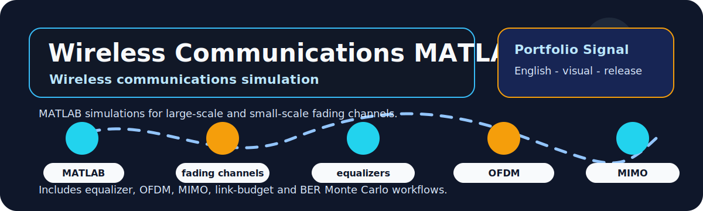

# Wireless Communications MATLAB Project

  
  
  

  

## Overview

This repository presents a MATLAB wireless-communications project covering fading channels, equalizers, OFDM, MIMO, link-budget calculations and BER Monte Carlo simulations.

| Field | Details |
|---|---|
| Repository | [TruyenThongKhongDay](https://github.com/lhlizdabezt/TruyenThongKhongDay) |
| Portfolio category | Wireless communications simulation project |
| Primary stack | MATLAB, wireless communications, fading channels, equalizers, OFDM, MIMO, link budget, BER, Monte Carlo simulation. |
| Latest release | [GitHub Releases](https://github.com/lhlizdabezt/TruyenThongKhongDay/releases/latest) |
| Tags | [Version tags](https://github.com/lhlizdabezt/TruyenThongKhongDay/tags) |
| Owner profile | [Luong Hai Long](https://github.com/lhlizdabezt) |

## Reviewer Map

| What to Review | Where to Look | Why It Matters |
|---|---|---|
| Technical scope | This README and source tree | Gives a quick, bounded reading path before opening every file |
| Evidence assets | Release page and top-level project files | Shows what can be downloaded or inspected quickly |
| Implementation material | Source folders, scripts, notebooks or design files | Connects the portfolio claim to real project artifacts |
| Version history | Tags and release notes | Makes the repository easier to audit over time |

## Evidence Highlights

- Large-scale and small-scale fading simulations.
- Equalizer, OFDM and MIMO study flows.
- Link-budget and BER Monte Carlo analysis.
- Release-backed report and MATLAB simulation evidence.

## Repository Structure

| Path | Purpose |
|---|---|
| `BaiTap/` | Top-level directory included in the repository |
| `DoAn/` | Top-level directory included in the repository |
| `docs/` | Top-level directory included in the repository |
| `LICENSE` | Top-level file included in the repository |

## Scope and Boundaries

Course project and simulation evidence. The results are educational analysis, not commercial wireless-system validation.

## Role and Portfolio Context

Luong Hai Long presents this repository as telecommunications and MATLAB simulation evidence.

## Release and Tagging Notes

This repository is maintained as part of an English-facing engineering portfolio. Releases and tags are used to preserve reviewable snapshots of the project, including source state, documentation updates and any available visual or report assets.

## Writing Standard

The README follows an evidence-first style: direct technical nouns, clear project boundaries, release-backed artifacts and no inflated claims beyond what the repository can support.
