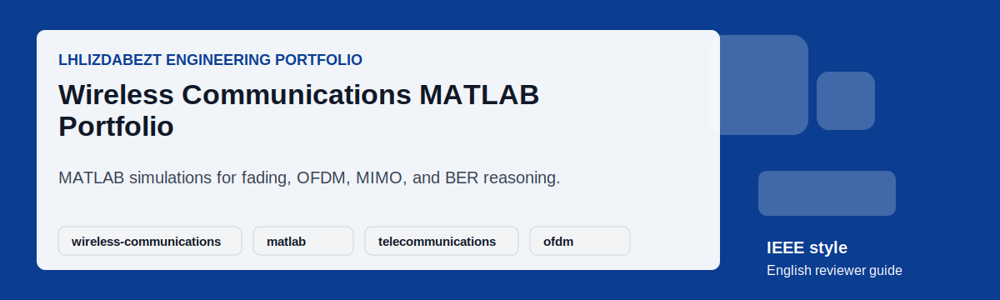

# Wireless Communications MATLAB Portfolio

## Executive Summary

This repository presents wireless communications coursework and project material as a MATLAB-focused engineering portfolio. It covers fading-channel behavior, equalization, OFDM and MIMO concepts, link-budget reasoning, Monte Carlo BER simulation, and reviewer-readable documentation for telecommunications roles.

## Project Snapshot

| Field | Details |
|---|---|
| Repository | [lhlizdabezt/TruyenThongKhongDay](https://github.com/lhlizdabezt/TruyenThongKhongDay) |
| Portfolio Track | Wireless communications, MATLAB simulations, fading channels, equalizers, OFDM, MIMO, and BER analysis |
| Public Status | Reviewer-ready English guide with release-backed evidence |
| Latest Release | [Open stable release](https://github.com/lhlizdabezt/TruyenThongKhongDay/releases/latest) |
| Owner Profile | [lhlizdabezt](https://github.com/lhlizdabezt) |
| Contact | 22207056@student.hcmus.edu.vn; luonghailong.work@gmail.com; Tel: +84988114708 |

## Reviewer Evidence Map

- MATLAB scripts and project folders for telecommunications simulation topics.
- Coursework or project evidence organized for public review.
- English README sections that connect equations, simulation, and engineering interpretation.
- Release-backed visual assets for a stable profile snapshot.

## Implementation Review Notes

| Review Point | What To Check |
|---|---|
| Problem framing | Confirm that the README explains the engineering purpose without exaggerated claims. |
| Technical evidence | Inspect the source folders, reports, scripts, schematics, or visual assets listed below. |
| Reproducibility | Use the local instructions where tools are available, or rely on the release snapshot for portfolio review. |
| Communication quality | Check headings, captions, tables, and release notes for clear English technical writing. |
| Professional boundary | Treat the repository as educational or portfolio evidence unless the source explicitly proves production deployment. |

## Repository Structure

| Path | Reviewer Purpose |
|---|---|
| `DoAn/` | Project material and wireless communications evidence when available. |
| `BaiTap/` | Exercise or coursework material when available. |
| `*.m` | MATLAB simulation scripts and functions. |
| `assets/` | English reviewer card and visual motion assets. |
| `RELEASE_NOTES.md` | Release changelog for the English reviewer guide. |

## How To Review

- Use this README to map the simulation topics before opening MATLAB files.
- Inspect scripts for channel modeling, modulation, equalization, or BER simulation logic.
- Review plots, reports, and release assets for result interpretation.
- Use the latest release as the stable public portfolio state.

## How To Use Or Inspect Locally

- Open MATLAB and set the repository root or target project folder as the current directory.
- Run the relevant `.m` script for the wireless communications topic under review.
- Check assumptions such as SNR range, channel model, modulation order, and sample size.
- Use generated figures and comments to interpret BER or signal-processing behavior.

## Visual Evidence

*Animated English reviewer card.*

## Release, Tags, And Topics

- Current release target: `reviewer-guide-2026-06-02`.
- Recommended topic set: `wireless-communications, matlab, telecommunications, ofdm, mimo, ber, fading-channels, signal-processing, equalization, monte-carlo`.
- Release notes are maintained in [`RELEASE_NOTES.md`](RELEASE_NOTES.md) for stable reviewer traceability.
- The release archive is intended for HR review, seminar evidence, and academic portfolio verification.

## Contact And Professional Links

| Channel | Link |
|---|---|
| GitHub | [https://github.com/lhlizdabezt](https://github.com/lhlizdabezt) |
| LinkedIn | [https://www.linkedin.com/in/lhlizdabezt](https://www.linkedin.com/in/lhlizdabezt) |
| Facebook | [https://www.facebook.com/wageseadrake](https://www.facebook.com/wageseadrake) |
| Instagram | [https://www.instagram.com/lhlizdabezt](https://www.instagram.com/lhlizdabezt) |
| YouTube | [https://www.youtube.com/@lhlizdabezt](https://www.youtube.com/@lhlizdabezt) |
| TikTok | [https://www.tiktok.com/@wageseadrake](https://www.tiktok.com/@wageseadrake) |
| Academic Email | [22207056@student.hcmus.edu.vn](mailto:22207056@student.hcmus.edu.vn) |
| Professional Email | [luonghailong.work@gmail.com](mailto:luonghailong.work@gmail.com) |
| Phone | [+84988114708](tel:+84988114708) |

## FAQ

| Question | Answer |
|---|---|
| What engineering area does this repository support? | Telecommunications, wireless communications, signal processing, and MATLAB simulation work. |
| Is this a hardware radio implementation? | No. The public framing is MATLAB simulation and engineering analysis. |
| What should reviewers look for? | Correct modeling assumptions, clear simulation structure, and meaningful BER or performance interpretation. |

## Scope And Boundaries

- This repository is presented as public engineering portfolio evidence.
- Claims are intentionally limited to what the repository, report, source files, simulations, or visual assets can support.
- Public text is written in English (United States) for HR, faculty, and engineering reviewers.
- SVG text is kept ASCII-safe to reduce rendering errors, mojibake, and missing-glyph blocks.
- Motion visuals avoid moving dotted paths, curved connector lines, and text-over-line compositions.

## Writing Standard

The public README, release notes, captions, and reviewer-facing metadata are written in a restrained IEEE and Harvard-inspired style: concise, evidence-first, technically accurate, and suitable for Electronics and Telecommunications portfolio review.
